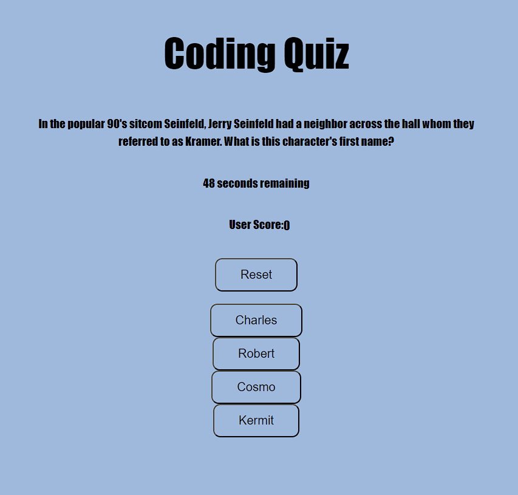

# Coding Quiz

## Description

Welcome to the coding quiz that actually is not a coding quiz but a fun little trivia quiz. If you know the answers, congratulations! If not, that's ok but just know that the timer will subtract a few (or more!) seconds each time you answer a question incorrectly.  
At the end of the quiz you will be able to input your initials and post them to the high score!

## Links

GitHub Repo: https://github.com/buster35/mohini-fluctus

GitHub Pages: 

## Screenshot

## License

Please refer to the LICENSE in the root directory.